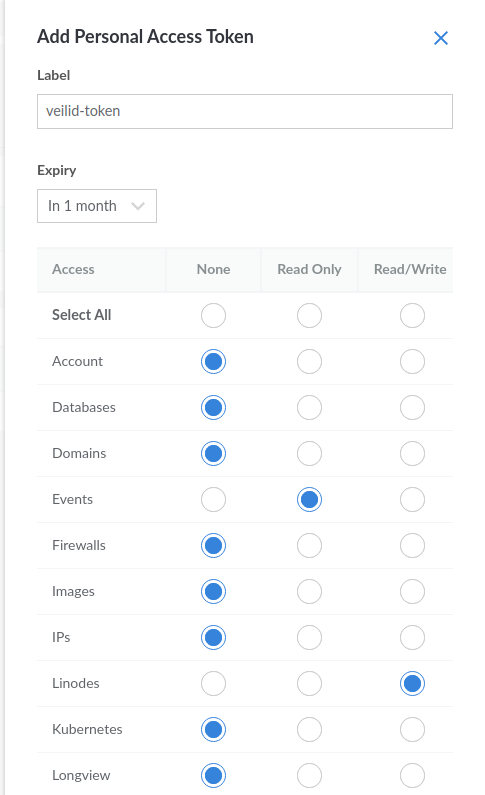

# Veilid Terraform Linode

Details at https://veilid.com/

Linode doesn't have a free tier, but it's still very cheap compared to the big 3 (AWS/GCP/Azure), so if you wanna run some veilid nodes on the cheap in the lesser cloud, you've come to the right place!

The nanodes will cost you about $5/month.

## Setting up the node(s)

1. If you don't have an account with [Linode](https://www.linode.com/), then sign up for that.

2. Get an API token to authenticate during terraform runs. This can be generated at https://cloud.linode.com/profile/tokens. Use the example in `.env.example` and rename it to `.env`, add in your token and then run `source .env`.

Make sure the token has Read Only scope for Events and Read/Write scope for Linodes (see screenshot below).



3. Fill in the value for your SSH key (if you want to be able to SSH in and poke around. If you don't, then just skip this part) in `setup-veilid.yaml`.

> If you want to use a separate SSH key, then generate one in this folder like `ssh-keygen -t ed25519 -o -a 100 -f veilid-key`. Then, make sure to update `setup-veilid.yaml` with the key contents.

4. Now you should be able to run `terraform init && terraform apply`.

You should see the IP address in the output

```sh
Outputs:

public_ip = [
  "172.232.139.79",
]
```

5. If you added an SSH key to use, you can now access the node(s) and see how veilid is running via

```sh
ssh -i PATH_TO_SSH_KEY veilid@IP_ADDRESS_FROM_OUTPUT
```
